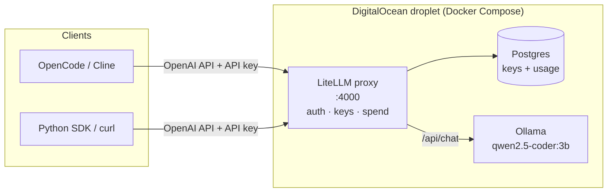

# ollama-litellm-coder

A self-hosted, OpenAI-compatible coding model on a single DigitalOcean droplet, built with one `terraform apply`.

**In short:** this runs `qwen2.5-coder:3b` behind a LiteLLM proxy for about **$48/month flat**, with no per-token charges, and code never leaves infrastructure we control. It is a good fit for everyday coding help: explanations, small edits, snippets, commit messages. It is **not** a replacement for frontier models on long, multi-step agent tasks. The realistic target is a hybrid setup: route routine work here and hard tasks to a paid API.

| | |
|---|---|
| **Model** | `qwen2.5-coder:3b` (Q4, ~1.9 GB), 32k-token context |
| **Serving** | Ollama (inference) behind LiteLLM (auth, keys, spend tracking, OpenAI-compatible API) |
| **Hardware** | DigitalOcean `s-4vcpu-8gb`: 4 shared vCPUs, 8 GB RAM, **CPU only** |
| **Cost** | ~$48/month (billed hourly; destroy when idle to pay less) |
| **Clients** | Anything OpenAI-compatible: OpenCode, Cline, the `openai` / `litellm` Python SDKs, `curl` |
| **Provisioning** | Terraform + cloud-init; no manual steps on the server |

---

## Architecture



- **Terraform** creates the droplet, the cloud firewall, and the droplet's `user_data`.
- **cloud-init** installs Docker, writes the Compose stack and a root-only `.env` with the secrets, and starts everything.
- **Docker Compose** runs three long-running services and two one-shot jobs:
  - `postgres`: LiteLLM's database for API keys and usage logs.
  - `ollama`: runs the model.
  - `litellm`: the API clients talk to.
  - `ollama-pull-model` and `litellm-create-key`: one-shot jobs that download the model and create the client API key on first boot.

## Where it fits, and where it doesn't

**Good fit**
- Explaining code, errors and stack traces
- Writing small functions, tests, regexes, SQL, shell one-liners
- Focused edits to one file with clear instructions
- Commit messages, docstrings, summaries
- Anything where code must not go to a third-party API

**Poor fit**
- Autonomous, multi-step agent work (plan → edit many files → run → fix). 3B models lose track, repeat tool calls, or break the tool-call format.
- Large-context work (whole-repo questions). Reading long prompts on CPU is slow; see [Performance](#performance).
- Many concurrent users. Ollama is set to one request at a time for maximum single-user speed.

## Performance

> **Status:** measurements pending. The figures below are pre-measurement estimates for a 3B Q4 model on 4 shared vCPUs; replace them with measured numbers before relying on them.

| Metric | Estimate | Measured |
|---|---|---|
| Output speed | ~8–15 tokens/s | _TBD_ |
| Prompt reading (prefill) | ~50–150 tokens/s | _TBD_ |
| Time to first token, 1k-token prompt | ~7–20 s | _TBD_ |
| Time to first token, 12k-token prompt (typical agent system prompt) | ~1.5–4 min | _TBD_ |

**What that means in practice**
- On CPU, the bottleneck is **reading the prompt**, not writing the answer. Short chat prompts feel fine; agent tools, which send 5–12k tokens of instructions on every request, feel slow.
- Within one conversation, Ollama reuses the part of the prompt it has already read, so follow-up turns are much faster than the first.
- The main hardware lever is a dedicated-CPU droplet (`c-4`, $84/month), which should improve both speed and consistency. It's worth benchmarking before committing.

**Measure it yourself** with [`benchmark.py`](benchmark.py), which calls the model through LiteLLM exactly as clients do:

```bash
uv run benchmark.py --markdown     # prompts of ~1k, 4k, 8k and 16k tokens, 2 runs each
```

It reports time to first token, prefill (prompt-reading) speed and output speed per prompt size, using the token counts the server reports. Each request starts with a unique marker so Ollama can't reuse a cached prompt, which would make repeats look unrealistically fast. The full default run can take 20+ minutes on CPU; `--sizes 1000 4000 -r 1` gives a quick first look.

## Cost

| Option | Monthly | Notes |
|---|---|---|
| This project (`s-4vcpu-8gb`) | **$48** | Flat, unlimited tokens, shared by the team |
| Dedicated CPU (`c-4`) | $84 | Faster, consistent performance |
| Paid API / per-seat tools | _TBD_ | Fill in current spend for comparison |

Droplets are billed hourly, so a droplet that only runs during work hours costs less. LiteLLM records usage per API key, which gives real numbers for the comparison above.

## Security

**Current state (proof of concept):**
- Access requires an API key. The client key is limited to one model and cannot perform admin actions; the master key is separate and used only for administration.
- Secrets come from environment variables (never committed), are marked sensitive in Terraform, and are stored on the droplet in a root-only file (`0600`).
- SSH is key-only.

**Known gaps (to fix before wider use):**
- **No TLS.** The API is plain HTTP on port 4000, so keys and prompts travel unencrypted.
- **Ports 22 and 4000 are open to the internet.** Planned fix: Tailscale (or WireGuard), then close both.
- **Ollama's port (11434) is published on the host.** The cloud firewall blocks it, but Ollama has no authentication; it should be reachable only on the internal Docker network.
- **Secrets are also in Terraform state and droplet metadata.** State files are git-ignored; remote encrypted state is planned.
- **Container images use `latest` tags.** Planned fix: pin versions.
- **Postgres uses a default password** (reachable only on the internal Docker network).

## Quick start

### Prerequisites
- Terraform ≥ 1.3
- A DigitalOcean API token, and your SSH public key uploaded to DigitalOcean (name it in `ssh_key_names`)
- Python 3.11+ and [uv](https://docs.astral.sh/uv/) (only for the example script)

### 1. Configure secrets

Create a `.env` file (git-ignored):

```bash
TF_VAR_do_token=dop_v1_...
TF_VAR_litellm_master_key=sk-...                        # admin key
TF_VAR_litellm_api_key=sk-<generate with: openssl rand -hex 24>   # client key
```

### 2. Deploy

```bash
set -a; source .env; set +a
terraform init
terraform apply
```

The first boot takes a few minutes: packages install, images download, the model downloads, and the client key is created. To check progress:

```bash
ssh root@$(terraform output -raw droplet_ip) 'cloud-init status --wait; docker ps'
```

### 3. Connect a client

| Setting | Value |
|---|---|
| Base URL | `http://<droplet-ip>:4000/v1` |
| API key | the value of `TF_VAR_litellm_api_key` |
| Model | `qwen2.5-coder-3b` |

**Python** (see [`main.py`](main.py)):

```python
from litellm import completion

response = completion(
    model="litellm_proxy/qwen2.5-coder-3b",
    api_base="http://<droplet-ip>:4000",
    api_key="sk-...",
    messages=[{"role": "user", "content": "Write a function that reverses a string."}],
)
print(response.choices[0].message.content)
```

Run the example with `LITELLM_PROXY_API_BASE=http://<droplet-ip>:4000` in `.env`, then `uv run main.py`.

**OpenCode** (`opencode.json`):

```json
{
  "$schema": "https://opencode.ai/config.json",
  "provider": {
    "litellm": {
      "npm": "@ai-sdk/openai-compatible",
      "name": "LiteLLM (droplet)",
      "options": {
        "baseURL": "http://<droplet-ip>:4000/v1",
        "apiKey": "{env:LITELLM_API_KEY}"
      },
      "models": { "qwen2.5-coder-3b": { "name": "qwen2.5-coder 3B" } }
    }
  }
}
```

**Cline:** choose the *OpenAI Compatible* provider and enter the base URL, API key and model ID from the table above.

## Repository layout

| File | Purpose |
|---|---|
| `main.tf` | Droplet, firewall, and rendering of cloud-init `user_data` |
| `variables.tf` | Inputs, with validation for keys |
| `outputs.tf` | Droplet IP and LiteLLM endpoint |
| `cloud-init.yaml.tftpl` | Server setup: installs Docker, writes the stack files and `.env`, starts Compose |
| `docker-compose.yml` | The stack: Postgres, Ollama, LiteLLM, and the one-shot setup jobs |
| `litellm-config.yaml` | Model routing and inference settings (context size, threads, keep-alive) |
| `main.py` | Example client using the LiteLLM SDK |
| `benchmark.py` | Measures time to first token, prefill and output speed at several prompt sizes |

## Design decisions

- **LiteLLM in front of Ollama.** Ollama has no authentication. LiteLLM adds API keys, per-key model limits, usage tracking, and an OpenAI-compatible API. It is also the path to the hybrid setup: adding a paid model is one entry in `litellm-config.yaml`, and clients keep the same URL and key.
- **cloud-init, not SSH provisioners.** The droplet builds itself from `user_data`, so `terraform apply` needs no SSH connection and the build is repeatable. The Compose file is the single source of truth and is passed in unchanged (base64-encoded).
- **A 3B model.** It fits comfortably in 8 GB alongside the 32k-token context cache and is the fastest option that still writes useful code on CPU. `qwen2.5-coder:7b` is noticeably better but roughly half the speed.
- **Tuned for one fast user, not many.** One request at a time, the model kept loaded permanently, flash attention, and an 8-bit context cache. Each choice favors single-request latency over concurrency.
- **Rebuilds are cheap and complete.** Changing the stack changes `user_data`, which rebuilds the droplet from scratch. Data in Postgres (keys, usage) is recreated on boot; persistent storage is on the roadmap.

## Roadmap

1. Run `benchmark.py` on the droplet and replace the estimates above with measured numbers
2. Tailscale for private access; close public ports
3. Pin container image versions
4. Hybrid routing: local model for routine work, a paid model for hard agent tasks, both through LiteLLM
5. Reserved IP and fixed SSH host key, so rebuilds keep the same address
6. Persistent volume for Postgres and the model; remote Terraform state
7. Evaluate `c-4` (dedicated CPU) and `qwen2.5-coder:7b`
